<a id="top"></a>

<!--
  ══════════════════════════════════════════════════════════════════════
   NAKKA REDDEPPA — GitHub Profile README
   Repo: github.com/ReddeppaNakka/ReddeppaNakka  (special profile repo)

   Palette   #2563EB electric blue · #8B5CF6 purple · #06B6D4 cyan
             #10B981 emerald · #0D1117 canvas · #94A3B8 muted text
   Setup     see SETUP.md
  ══════════════════════════════════════════════════════════════════════
-->

<div align="center">


<a href="https://reddeppa-portfolio.netlify.app/">
  
</a>

<br/>

> *“Strong fundamentals, clean code, and learning through real-world projects.”*

<br/>

<!-- ─── Live counters ─────────────────────────────────────────────── -->


&nbsp;
<a href="https://github.com/ReddeppaNakka?tab=followers">
  
</a>
&nbsp;
<a href="https://github.com/ReddeppaNakka?tab=repositories">
  
</a>
&nbsp;
<a href="https://github.com/ReddeppaNakka?tab=stars">
  
</a>

<br/><br/>

<a href="https://reddeppa-portfolio.netlify.app/"></a>
<a href="https://www.linkedin.com/in/nakka-reddeppa-01187a22a"></a>
<a href="mailto:reddeppanakka@gmail.com"></a>

<br/><br/>


</div>

<br/>

## &nbsp; Introduction

I'm **Reddeppa** — a Computer Science graduate from Hyderabad who builds things that actually run.

My centre of gravity is **backend engineering**: RESTful APIs, database design, and secure, scalable systems in Python, Django, Flask, and Node.js. Over the last year that work has pulled me toward **AI engineering**, where the interesting problems live at the seam between the two — orchestrating language models behind clean, well-typed service boundaries instead of bolting a chatbot onto a page.

Most of my day-to-day code ships into a repository I don't own. On **[SmartTask AI](https://github.com/Munidhar05/Task-Manager1)** I'm the lead contributor — **115 of 137 commits, 36 merged pull requests, none left open** — building voice task dictation, Google OAuth, multi-tenant admin, and the Android release pipeline for a product now headed to the Play Store. Every one of those changes went through someone else's review before it landed.

Alongside that, I build agents. **[Atlas](https://github.com/ReddeppaNakka/Treckgroq)** is an agentic travel recommender: a five-stage reasoning pipeline over 112 curated destinations, served by FastAPI and LangChain against LLaMA 3.3 70B. **[Signal_IQ](https://github.com/ReddeppaNakka/Signal_IQ)** is an autonomous intelligence platform that researches, ranks, and briefs — built on Next.js 15 and the Claude SDK, and designed to degrade gracefully to mock data when no API key is present. **[Orvix](https://github.com/ReddeppaNakka/Orvix)** keeps itself current through a GitHub Actions cron that scrapes, parses with an LLM, and upserts to Supabase — no hardcoded content, ever.

Before the agents, there was the science. My academic work applied **hybrid CNN-RNN architectures** and **ensemble voting classifiers** to histopathological image classification for endometriosis detection, and **DenseNet** to offline signature verification. Those projects taught me the discipline that carries into everything else: measure honestly, and let the data close the argument.

I care about fundamentals over frameworks, and about shipping something someone can use over shipping something that demos well.

<div align="center"></div>

## &nbsp; About Me

<table>
<tr>
<td width="50%" valign="top">

### Profile

|  |  |
|:--|:--|
| **Role** | Software Engineer — Backend & AI |
| **Education** | B.Tech, Computer Science |
| **Location** | Hyderabad, India `UTC+5:30` |
| **Portfolio** | [reddeppa-portfolio.netlify.app](https://reddeppa-portfolio.netlify.app/) |
| **Email** | [reddeppanakka@gmail.com](mailto:reddeppanakka@gmail.com) |
| **LinkedIn** | [nakka-reddeppa](https://www.linkedin.com/in/nakka-reddeppa-01187a22a) |
| **Résumé** | [Download PDF](https://reddeppa-portfolio.netlify.app/) |

</td>
<td width="50%" valign="top">

### Signal

|  |  |
|:--|:--|
| **Current focus** | Agentic AI systems & API design |
| **Learning now** | System design · Postgres internals · Cloud |
| **Interests** | Applied ML · Developer tooling · Clean architecture |
| **Open to** | `Software Engineer` `Backend` `AI/ML` |
| **Availability** |  |
| **Response time** | Usually within 24 hours |
| **Collaboration** | Open source, AI tooling, backend systems |

</td>
</tr>
</table>

<div align="center"></div>

## &nbsp; Tech Stack

<div align="center">

**Languages**


**Backend & APIs**


**Frontend**


**AI / ML**


&nbsp;


**Data & Databases**


&nbsp;


**Cloud, DevOps & Tools**


**Testing, Design & Misc**


&nbsp;


</div>

<br/>

<details>
<summary><b>&nbsp;Technology radar — where my depth actually sits</b></summary>

<br/>

<div align="center">
  
</div>

> Self-assessed, and deliberately honest. Backend and applied ML are where I've shipped the most; cloud and DevOps are where I'm actively investing. I'd rather show you the shape of the curve than claim it's flat at 100%.

</details>

<div align="center"></div>

## &nbsp; GitHub Analytics

<div align="center">


<br/><br/>


<!-- WakaTime card intentionally omitted — it renders an error until coding
     activity is made public. See SETUP.md § WakaTime & Spotify to enable it. -->

<br/><br/>


<br/><br/>


<br/>

**Contribution Heatmap**


<br/><br/>

**Contribution Snake**

<picture>
  <source media="(prefers-color-scheme: dark)" srcset="https://raw.githubusercontent.com/ReddeppaNakka/ReddeppaNakka/output/snake-dark.svg" />
  <source media="(prefers-color-scheme: light)" srcset="https://raw.githubusercontent.com/ReddeppaNakka/ReddeppaNakka/output/snake.svg" />
  
</picture>

</div>

<br/>

<details>
<summary><b>&nbsp;Recent activity — updated automatically every 12 hours</b></summary>

<br/>

<!-- RECENT_ACTIVITY:start -->
- **Merged a pull request in** [`Munidhar05/Task-Manager1`](https://github.com/Munidhar05/Task-Manager1) <sub>`collaboration`</sub> <sub>14 Jul 2026</sub>
- **Pushed to** [`ReddeppaNakka/Orvix`](https://github.com/ReddeppaNakka/Orvix) <sub>12 Jul 2026</sub>
- **Starred** [`ReddeppaNakka/Treckgroq`](https://github.com/ReddeppaNakka/Treckgroq) <sub>12 Jul 2026</sub>
- **Pushed to** [`ReddeppaNakka/ReddeppaNakka`](https://github.com/ReddeppaNakka/ReddeppaNakka) <sub>12 Jul 2026</sub>
- **Created** [`ReddeppaNakka/Signal_IQ`](https://github.com/ReddeppaNakka/Signal_IQ) <sub>25 Jun 2026</sub>
<!-- RECENT_ACTIVITY:end -->

<sub>Last refreshed: <!-- LAST_UPDATED:start -->14 Jul 2026, 15:08 UTC<!-- LAST_UPDATED:end --></sub>

</details>

<div align="center"></div>

## &nbsp; Featured Projects

<div align="center">

<a href="https://github.com/Munidhar05/Task-Manager1">
  
</a>
<a href="https://github.com/ReddeppaNakka/Treckgroq">
  
</a>

<a href="https://github.com/ReddeppaNakka/Signal_IQ">
  
</a>
<a href="https://github.com/ReddeppaNakka/My-Portfolio">
  
</a>

<a href="https://github.com/ReddeppaNakka/Orvix">
  
</a>
<a href="https://github.com/ReddeppaNakka/Automated-Endometriosis-Detection-Using-Histopathological-Image-Data-with-a-Hybrid-CNNRNN-Model">
  
</a>

</div>

<br/>

<!-- ═══ PROJECT: SMARTTASK AI ════════════════════════════════════════ -->
<details open>
<summary><h3 style="display:inline">&nbsp;SmartTask AI — Production Task Manager · Android + Web</h3></summary>

<br/>

<div align="center">


</div>

<br/>

A real task-management product — **not a tutorial CRUD app**. Web client plus a native **Android build headed for the Play Store**, backed by an Express API with realtime sync. I'm the lead contributor: **115 of 137 commits and 36 merged pull requests**, every one reviewed and merged by the repository owner.

**Stack** &nbsp; &nbsp;`Capacitor` &nbsp;`WebSockets` &nbsp;`JWT` &nbsp;`Google OAuth` &nbsp;`ONNX Runtime Web` &nbsp;`Render`

**Architecture**

```
 ┌────────────────────────┐   ┌────────────────────────┐
 │ React + TS web client  │   │ Capacitor Android APK  │
 │ react-router           │   │ push notifications     │
 │ ONNX Runtime Web       │   │ keep-awake · splash    │
 └───────────┬────────────┘   └───────────┬────────────┘
             └─────────────┬──────────────┘
                           │ REST + WebSocket (ws)
                           ▼
            ┌────────────────────────────┐
            │  Express API on Render     │  region:
            ├────────────────────────────┤  singapore
            │ JWT + bcrypt auth          │
            │ google-auth-library OAuth  │
            │ better-sqlite3 + disk      │
            │ nodemailer · multer · xlsx │
            └────────────────────────────┘
```

**Features I built and shipped**

| | |
|:--|:--|
| **Voice task dictation** | Speech-to-task on Android, with an OpenRouter LLM engine for parsing. Fixed duplicated-word capture on continuous listening; keeps listening until explicit Stop. |
| **Google Sign-In** | OAuth via `google-auth-library`, alongside JWT + bcrypt credential auth. |
| **Multi-tenant admin** | Super-admin role and platform-level organisation drill-down. |
| **Android release pipeline** | Play Store signing config, launcher icon, splash screen, and the Privacy Policy page Google requires for submission. |
| **Realtime + notifications** | WebSocket sync, push notifications, notification sounds. |
| **Production deploy** | Render blueprint with a persistent disk so SQLite and uploads survive redeploys. |

**What I learned that a solo project can't teach**

Working daily in someone else's codebase, behind review, changes how you write code. You stop optimising for "it works on my machine" and start optimising for "the maintainer can read this in thirty seconds." The Render persistent-disk decision is a good example — the free tier has no disk, so SQLite would silently reset on every redeploy. Catching that *before* shipping is the difference between a demo and a product.

<div align="center">
<a href="https://github.com/Munidhar05/Task-Manager1"></a>
&nbsp;
<a href="https://github.com/Munidhar05/Task-Manager1/pulls?q=is%3Apr+author%3AReddeppaNakka+is%3Amerged"></a>
</div>

</details>

<!-- ═══ PROJECT: ATLAS ═══════════════════════════════════════════════ -->
<details>
<summary><h3 style="display:inline">&nbsp;Atlas — Agentic AI Travel Recommender</h3></summary>

<br/>

<div align="center">
<a href="https://treckgroq-1.onrender.com/"></a>


</div>

<br/>

An agentic travel application that recommends destinations by reasoning over your **budget, travel season, and interests** — not by keyword-matching a database. It carries **112 curated destinations across 6 continents and 62 countries**, each with structured metadata, and returns recommendations alongside the reasoning trace that produced them.

**Stack** &nbsp; &nbsp;`LangChain` &nbsp;`Groq — LLaMA 3.3 70B`

**Reasoning pipeline**

```
  natural language query
          │
          ▼
  ┌───────────────────┐
  │ 1  intent extract │  budget · season · interests, from text
  └─────────┬─────────┘
            ▼
  ┌───────────────────┐
  │ 2  filter         │  narrow 112 dests by season + region
  └─────────┬─────────┘
            ▼
  ┌───────────────────┐
  │ 3  cost model     │  compute trip cost against stated budget
  └─────────┬─────────┘
            ▼
  ┌───────────────────┐
  │ 4  rank           │  score seasonal fit × interest alignment
  └─────────┬─────────┘
            ▼
  ┌───────────────────┐
  │ 5  synthesize     │  LLM writes the personalized recommendation
  └─────────┬─────────┘
            ▼
   POST /api/recommend  →  { recommendations[], reasoning_trace[] }
```

**What I'd point at in a code review**
- The LLM is the *last* stage, not the first — deterministic filtering and cost math happen in Python, so results are reproducible and cheap.
- `/api/recommend` returns a reasoning trace, which makes the agent debuggable instead of a black box.
- The frontend renders match percentages, cost breakdowns, and best-travel-months as first-class UI, not an afterthought.

<div align="center">
<a href="https://treckgroq-1.onrender.com/"></a>
&nbsp;
<a href="https://github.com/ReddeppaNakka/Treckgroq"></a>
</div>

> **Note on the demo:** it's hosted on Render's free tier, which sleeps after inactivity — the first request may take 30–60 seconds to wake the service, then it's fast.

</details>

<!-- ═══ PROJECT: SIGNAL_IQ ═══════════════════════════════════════════ -->
<details>
<summary><h3 style="display:inline">&nbsp;Signal_IQ — Autonomous Intelligence Platform</h3></summary>

<br/>

<div align="center">


</div>

<br/>

An agentic platform that scans the web, ranks by importance, filters noise, and delivers a personalized briefing. *Perplexity × Bloomberg Terminal × Feedly* — except it behaves like an autonomous agent working on your behalf.

**Stack** &nbsp; &nbsp;`Claude SDK` &nbsp;`Framer Motion` &nbsp;`Recharts` &nbsp;`Clerk`

**Five-stage agent pipeline**

```
 RESEARCH ─▶ RANKING ─▶ INTELLIGENCE ─▶ PERSONALIZE ─▶ BRIEFING
    │           │            │              │             │
 HN · arXiv  importance  Claude SDK     behavioural    digest +
 RSS feeds    scoring    synthesis     affinity model   report
```

**Engineering decisions worth naming**
- **Zero-config by default.** No API key? It runs on mock data. No Postgres? In-memory store. No Clerk? Demo user. The project is runnable in one command by anyone who clones it — which is how a portfolio project *should* behave.
- **"Go live" is a toggle, not a rewrite** — the same pipeline swaps mock sources for Hacker News, arXiv, and free RSS.
- Optional cron ingestion, Resend email digests, and printable HTML reports round out the product surface.
- Grounded chat assistant, watchlists, and saved stories feed a behavioural affinity model that personalizes ranking over time.

<div align="center">
<a href="https://github.com/ReddeppaNakka/Signal_IQ"></a>
</div>

</details>

<!-- ═══ PROJECT: ORVIX ═══════════════════════════════════════════════ -->
<details>
<summary><h3 style="display:inline">&nbsp;Orvix — Self-Updating Tech Intelligence Platform</h3></summary>

<br/>

<div align="center">


</div>

<br/>

A free, open-source platform tracking developments across programming languages, frameworks, and frontier AI models. **Nothing is hardcoded** — the content refreshes daily through an automated scrape-and-parse pipeline.

**Stack** &nbsp;

**Data pipeline**

```
 ┌──────────────────┐  cron   ┌──────────────────┐
 │  GitHub Actions  │────────▶│  Python scraper  │ feedparser
 └──────────────────┘  daily  └────────┬─────────┘ requests
                                       │ raw HTML / RSS
                                       ▼
                              ┌──────────────────┐
                              │  LLM parse layer │ Groq / Gemini
                              └────────┬─────────┘ (free tier)
                                       │ structured JSON
                                       ▼
                              ┌──────────────────┐
                              │ Supabase Postgres│ upsert, dedup
                              └────────┬─────────┘ on source URL
                                       │ SSR fetch
                                       ▼
                              ┌──────────────────┐
                              │  Next.js 15 App  │ on Vercel
                              └──────────────────┘
```

**Why it's interesting**
- The entire system — scheduler, LLM, database, hosting — runs on **free tiers**. Constraint drove the architecture.
- Using an LLM as a *parser* rather than a *generator* means the output is grounded in real scraped sources.
- `TypeScript 70.3% · Python 21.8% · PLpgSQL 7.4%` — the SQL isn't incidental; dedup and upsert logic live in the database where they belong.

<div align="center">
<a href="https://github.com/ReddeppaNakka/Orvix"></a>
</div>

</details>

<!-- ═══ PROJECT: PORTFOLIO ═══════════════════════════════════════════ -->
<details>
<summary><h3 style="display:inline">&nbsp;My-Portfolio — Personal Portfolio Website</h3></summary>

<br/>

<div align="center">


</div>

<br/>

A responsive React portfolio covering projects, skills, experience, and certifications — built around clean architecture and user-centric navigation.

**Stack** &nbsp;

<div align="center">
<a href="https://reddeppa-portfolio.netlify.app/"></a>
&nbsp;
<a href="https://github.com/ReddeppaNakka/My-Portfolio"></a>
</div>

</details>

<div align="center"></div>

## &nbsp; Applied ML Research

> Academic work in medical imaging and biometric verification. Architectures and results below are what the repositories actually contain — no inflated metrics.

<table>
<tr>
<td width="50%" valign="top">

### Automated Endometriosis Detection
**Hybrid CNN-RNN · Histopathological imaging**

Classifies endometrial tissue types from histopathological image data using a hybrid convolutional–recurrent architecture. The CNN extracts spatial features from tissue patches; the LSTM head models sequential dependencies across them.

```
 tissue image
      │
      ▼
 ┌──────────┐   spatial features   ┌──────────┐
 │   CNN    │────────────────────▶ │   LSTM   │
 └──────────┘                      └────┬─────┘
                                        ▼
                                  tissue class
```

`Python` `TensorFlow` `Keras` `Jupyter`

<a href="https://github.com/ReddeppaNakka/Automated-Endometriosis-Detection-Using-Histopathological-Image-Data-with-a-Hybrid-CNNRNN-Model"></a>

</td>
<td width="50%" valign="top">

### Enhanced Endometriosis Diagnosis
**Ensemble voting classifier**

A companion study taking the classical-ML route: a voting classifier combining **SVM**, **Gradient Boosting**, and **Decision Tree** predictions. Useful as an interpretable baseline against the deep model above.

```
   features
      │
  ┌───┴───┬─────────┬──────────┐
  ▼       ▼         ▼          │
 SVM   GradBoost  DecTree      │
  └───┬───┴─────────┘          │
      ▼   soft vote            │
   diagnosis ◀─────────────────┘
```

`Python` `scikit-learn` `Pandas` `Jupyter`

<a href="https://github.com/ReddeppaNakka/Enhanced-Endometriosis-Diagnosis-with-Voting-Classifiers"></a>

</td>
</tr>
<tr>
<td colspan="2" valign="top">

### Signature Verification using DenseNet
**Offline biometric verification · Transfer learning**

Distinguishes genuine signatures from forgeries using a **DenseNet** backbone. Dense connectivity means every layer sees every prior feature map, which matters here: forgery detection lives in fine stroke-level detail that a plain deep stack tends to wash out.

`Python` `DenseNet` `TensorFlow` `OpenCV`

<a href="https://github.com/ReddeppaNakka/Signature-Verification-using-DensNET"></a>

</td>
</tr>
</table>

<div align="center"></div>

## &nbsp; Coding Journey

> Anchored to real commit history — every milestone below maps to a public repository.

```
 ●  Computer Science fundamentals
 │     Python · Java · C# · data structures · databases
 │
 ├─● 2025 · 05   Applied ML research lands
 │     Signature Verification (DenseNet)
 │     Endometriosis Detection (Hybrid CNN-RNN)
 │     Enhanced Diagnosis (Voting Classifiers)
 │
 ├─● 2025 · 06   Frontend depth
 │     WhatsApp Web clone — multi-panel React UI
 │
 ├─● 2026 · 02   First steps into agents
 │     Voice_Agent — speech in, speech out
 │
 ├─● 2026 · 05   Professional presence
 │     My-Portfolio — React, live on Netlify
 │
 ├─● 2026 · 06   Team development, under review
 │     SmartTask AI — joined as contributor, became lead
 │     115 commits · 36 merged PRs · 0 abandoned
 │     Voice dictation · Google OAuth · Android release
 │
 ├─● 2026 · 06   Agentic AI, in earnest
 │     Atlas — FastAPI + LangChain + LLaMA 3.3 70B
 │     Signal_IQ — 5-stage pipeline, Claude SDK, Next.js 15
 │
 ├─● 2026 · 07   Production systems
 │     Orvix — automated pipeline, Supabase, Actions cron
 │     SmartTask AI — Play Store submission prep
 │
 ▼
 ◆  NOW — seeking Software Engineering roles
       Backend · AI Engineering · Full Stack
```

<div align="center"></div>

## &nbsp; Goals Dashboard

<div align="center">

| Focus area | Progress | |
|:--|:--|:--|
| **System Design** |  | Reading, sketching, not yet shipping |
| **AI Engineering** |  | Three agentic projects shipped |
| **Backend Development** |  | Core strength |
| **Cloud Computing** |  | Render, Vercel, Netlify, Cloudflare |
| **Collaborative Dev** |  | 36 merged PRs under review, daily |
| **Open Source Commons** |  | Not the same thing. Upstream PRs next |
| **Competitive Programming** |  | Rebuilding the habit |
| **Technical Writing** |  | Section below is honestly empty |
| **Job Preparation** |  | Actively interviewing |

</div>

> These are self-assessed and intentionally not all near 100%. A dashboard where everything is finished isn't a dashboard.

<div align="center"></div>

## &nbsp; Interactive Terminal

> GitHub Markdown strips `<script>`, so nothing here is *executing*. What it is instead: collapsible `<details>` sections styled as a shell session — the closest thing to interactivity the platform actually permits. Click a command to run it.

```console
reddeppa@github:~$ help
```

<details>
<summary><code>&nbsp;$ whoami&nbsp;</code></summary>

```console
Nakka Reddeppa
Computer Science graduate · Hyderabad, India
Backend engineer drifting happily into AI engineering.

Builds RESTful APIs, database-backed systems, and agentic
LLM applications. Prefers fundamentals to frameworks.
```
</details>

<details>
<summary><code>&nbsp;$ cat skills.json&nbsp;</code></summary>

```jsonc
{
  "languages": ["Python", "JavaScript", "TypeScript",
                "Java", "C#", "PHP"],
  "backend":   ["FastAPI", "Django", "Flask", "Express",
                "Node.js", ".NET"],
  "frontend":  ["React", "Next.js", "Tailwind CSS", "Vite"],
  "ai_ml":     ["TensorFlow", "PyTorch", "Keras", "sklearn",
                "LangChain", "Claude SDK", "Groq"],
  "data":      ["PostgreSQL", "Supabase", "Prisma", "SQLite",
                "SQL Server", "Pandas", "NumPy"],
  "cloud":     ["Vercel", "Netlify", "Render", "Cloudflare",
                "GitHub Actions"],
  "strongest": "backend + applied ML",
  "learning":  "system design, Postgres internals, cloud"
}
```
</details>

<details>
<summary><code>&nbsp;$ ls -la projects/&nbsp;</code></summary>

```console
lrwxr-xr-x  SmartTask-AI/ -> Munidhar05/Task-Manager1
              React · Express · Capacitor · SQLite
              lead contributor · 115 commits · 36 merged PRs
drwxr-xr-x  Treckgroq/       Atlas — agentic travel recommender
              Python · FastAPI · LangChain · Groq
drwxr-xr-x  Signal_IQ/       Autonomous intelligence platform
              Next.js · Claude SDK · Prisma
drwxr-xr-x  Orvix/           Self-updating tech intelligence
              Next.js · Supabase · Python · Actions
drwxr-xr-x  My-Portfolio/    Portfolio site · live on Netlify
              React · JavaScript
drwxr-xr-x  Endometriosis/   Hybrid CNN-RNN + voting classifiers
              TensorFlow · Keras · scikit-learn
drwxr-xr-x  Signature-Verif/ DenseNet forgery detection
              TensorFlow · OpenCV

7 featured · 11 public repos owned · 1 upstream collaboration
```
</details>

<details>
<summary><code>&nbsp;$ cat experience.md&nbsp;</code></summary>

```console
Lead contributor · SmartTask AI (Munidhar05/Task-Manager1)
Jun 2026 – present

  · Wrote 115 of the project's 137 commits and landed 36 pull
    requests, all reviewed and merged by the repository owner,
    with none abandoned.
  · Built voice task dictation (Android speech capture + an
    OpenRouter LLM parsing engine), Google OAuth sign-in, task
    editing, super-admin roles, and org-level drill-down.
  · Owned the Android release pipeline: Play Store signing config,
    launcher icon, splash screen, and the required privacy policy.
  · Deployed the Express + SQLite API to Render with a persistent
    disk, so data survives redeploys.

Independent project work, 2025 – present

  · Designed and shipped three agentic AI applications end to end,
    covering API design, LLM orchestration, and frontend delivery.
  · Built an automated daily data pipeline (GitHub Actions → Python
    scraper → LLM parser → Supabase) running entirely on free tiers.
  · Authored applied ML research: hybrid CNN-RNN and ensemble
    classifiers for histopathological image classification.

Currently seeking a first full-time Software Engineering role.
Full history: reddeppa-portfolio.netlify.app
```
</details>

<details>
<summary><code>&nbsp;$ cat roadmap.txt&nbsp;</code></summary>

```console
[ next 3 months ]
  → System design fundamentals, working through real case studies
  → First upstream open-source PR
  → Deploy Atlas and Signal_IQ to public URLs

[ next 6 months ]
  → Cloud certification (AWS or GCP associate tier)
  → Publish first technical article
  → Contribute regularly to one OSS project

[ always ]
  → Read more code than I write
```
</details>

<details>
<summary><code>&nbsp;$ contact --all&nbsp;</code></summary>

```console
email      reddeppanakka@gmail.com
linkedin   linkedin.com/in/nakka-reddeppa-01187a22a
portfolio  reddeppa-portfolio.netlify.app
github     github.com/ReddeppaNakka
location   Hyderabad, India (UTC+5:30)
status     open to Software Engineering opportunities
```
</details>

<div align="center"></div>

## &nbsp; Achievements

<div align="center">

| | |
|:--|:--|
|  | 115 of 137 commits on a repository I don't own |
|  | 100% merge rate · zero pull requests abandoned |
|  | Play Store signing, splash, privacy policy, release build |
|  | GitHub achievement — merged pull requests |
|  | GitHub achievement — co-authored commits |
|  | Medical imaging & biometric verification |
|  | Atlas · Signal_IQ · Orvix |

</div>

> **Certifications, internships, and hackathons** — this section stays empty until there's something real to put in it. See [SETUP.md](./SETUP.md#adding-achievements) for the drop-in template.

<div align="center"></div>

## &nbsp; Currently

<table>
<tr>
<td width="33%" valign="top">

**Reading**

*Designing Data-Intensive Applications*
— Martin Kleppmann

The chapter on replication is doing real damage to how I thought databases worked.

</td>
<td width="33%" valign="top">

**Exploring**

`Postgres internals` · `LangGraph`
`Vector databases` · `Docker`

Curious about what happens when agent state outgrows a single request.

</td>
<td width="33%" valign="top">

**Building**

Extending **Orvix** with topic clustering, and polishing **[Atlas](https://treckgroq-1.onrender.com/)** — now live on Render — ahead of a wider launch.

</td>
</tr>
</table>

<br/>

<div align="center">

**Quote of the Day** — refreshes on every page load


</div>

<div align="center"></div>

## &nbsp; Roadmap Sections

<details>
<summary><b>&nbsp;Technical Writing — coming soon</b></summary>

<br/>

I haven't published articles yet, so rather than fake a blog feed, here's what's queued:

| Planned article | Topic |
|:--|:--|
| *Why the LLM should be the last stage of your pipeline* | AI Agents · Architecture |
| *Reproducible ML on a student budget* | Machine Learning |
| *Building a data pipeline that costs nothing* | Python · GitHub Actions |
| *FastAPI patterns I wish I'd known earlier* | FastAPI · Backend |
| *From CNN-RNN to agents: a graduate's path* | Career |

Once articles exist, [SETUP.md](./SETUP.md#technical-blog-automation) has the workflow that auto-syncs a Dev.to or Medium feed into this section.

</details>

<details open>
<summary><b>&nbsp;Collaborative Development & Open Source</b></summary>

<br/>

Most of my recent code doesn't live in a repository I own. I'm the **lead contributor on [`Munidhar05/Task-Manager1`](https://github.com/Munidhar05/Task-Manager1)** — 115 of its 137 commits, and **36 merged pull requests with none left open**, sustained daily from June 2026 to now.

<div align="center">


</div>

<br/>

Every one of those pull requests was reviewed and merged by someone else. That's the part I'd actually want a hiring manager to look at: not the commit count, but that the work survived review, every time, on a codebase with another maintainer.

**Where I still have ground to cover**

```
 [x]  Sustained contribution to a repo I don't own
          115 commits · 36 merged PRs
 [x]  Work through code review, not around it
          100% merge rate · 0 abandoned
 [x]  Publish my own work openly
          6 public projects
 [ ]  First PR to a public library I merely use
 [ ]  Resolve a "good first issue" upstream
 [ ]  Add an OSI license to my own repositories
```

The distinction matters and I'll name it: contributing heavily to a small team's private-facing product is **collaborative development**. It is not the same thing as contributing to the open-source commons, and I haven't done the latter yet.

</details>

<details>
<summary><b>&nbsp;Coding Platform Stats — intentionally omitted</b></summary>

<br/>

No LeetCode, Codeforces, or HackerRank cards here, because I don't yet have profiles worth showing. An empty stat card is worse than no stat card.

[SETUP.md](./SETUP.md#coding-platform-stats) contains ready-to-paste widgets for all five platforms — drop in a username and the section appears.

</details>

<details>
<summary><b>&nbsp;AI Assistant — a real integration path, not a mockup</b></summary>

<br/>

GitHub Markdown cannot execute JavaScript, so a chat widget embedded *in this README* is impossible. Anyone showing you one is showing you a screenshot.

What is possible, and what I'm building:

```
 ┌─────────────────────────────────────────────────┐
 │  ask.reddeppa-portfolio.netlify.app             │
 ├─────────────────────────────────────────────────┤
 │                                                 │
 │   ● Ask me about Reddeppa's work                │
 │                                                 │
 │   ┌───────────────────────────────────────┐     │
 │   │ What did he build with LangChain?     │     │
 │   └───────────────────────────────────────┘     │
 │                                                 │
 │   ▸ Atlas (Treckgroq) — a 5-stage agentic       │
 │     travel recommender. LangChain orchestrates  │
 │     intent extraction and final synthesis;      │
 │     filtering and cost math stay in Python.     │
 │                                                 │
 │     ↳ github.com/ReddeppaNakka/Treckgroq        │
 │                                                 │
 └─────────────────────────────────────────────────┘
```

**Architecture** — RAG over my résumé, repo READMEs, and project docs; embeddings in Supabase `pgvector`; Claude SDK for generation; Next.js route handler on Vercel. Linked from this README as a button, hosted on the portfolio.

Tracked in [SETUP.md](./SETUP.md#ai-assistant-integration).

</details>

<details>
<summary><b>&nbsp;Global Contribution Map</b></summary>

<br/>

There is no true interactive world map in GitHub Markdown — no JS, no iframes. The honest alternatives, in descending order of quality:

1. **This is the closest thing that's real:** contributions are already geo-anchored by timezone. I code from `Hyderabad, India · UTC+5:30`.
2. A static SVG map with a marker, committed to `assets/` and rendered as an image.
3. A live map on the [portfolio site](https://reddeppa-portfolio.netlify.app/), linked from here — where JavaScript actually runs.

Option 3 is where this is going. Rendering a fake "global contributor" map for a developer contributing from one city would be decoration pretending to be data.

</details>

<div align="center"></div>

## &nbsp; Connect

<div align="center">

I read every message. If you're hiring, collaborating, or just want to argue about whether the LLM belongs at the start or end of the pipeline — reach out.

<br/>

<a href="https://github.com/ReddeppaNakka">
  
</a>
<a href="https://www.linkedin.com/in/nakka-reddeppa-01187a22a">
  
</a>
<a href="https://reddeppa-portfolio.netlify.app/">
  
</a>
<a href="mailto:reddeppanakka@gmail.com">
  
</a>
<a href="https://www.instagram.com/redd_ykrishna">
  
</a>

<br/><br/>


</div>

<br/>

<div align="center">


<br/>

*“Build the thing. Measure it honestly. Then make it faster.”*

<br/>

**Thanks for reading this far.** &nbsp;If something here was useful, a ⭐ on a repo means a lot.

<br/>

<a href="#top"></a>

<br/>


</div>
